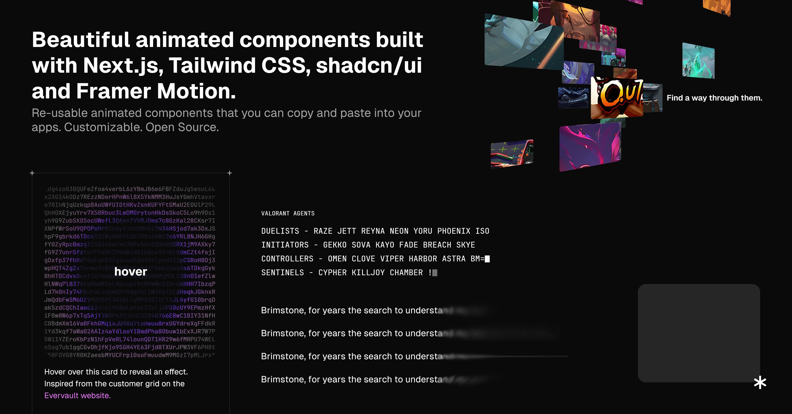

# asterisk/ui

A collection of re-usable animated components built using Next.js, Tailwind CSS, shadcn/ui and Framer Motion, that you can copy and paste into your apps.

## Docs
Visit [asterisk-ui docs](https://ui.asterisk.uno/docs ) to view the documentation.

## Built With

These components are powered by

- [Next.js](https://nextjs.org/)
- [Tailwind](https://tailwindcss.com/docs/installation)
- [Framer Motion](https://www.framer.com/motion/introduction/)
- [shadcn/ui](https://ui.shadcn.com/)

## Contributing

Please read [CONTRIBUTING.md](CONTRIBUTING.md) guide for details.

## License

This project is licensed under the [MIT license](LICENSE.md).

## Acknowledgments

- Based on the shadcn/ui design elements.
- Inspired from [codrops](https://tympanus.net/codrops/) designs and tutorials.
